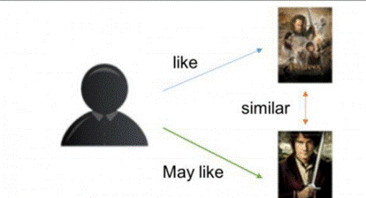
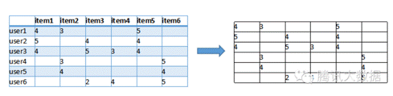
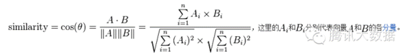
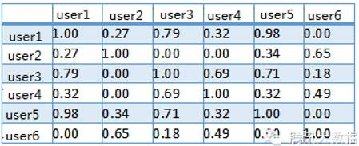
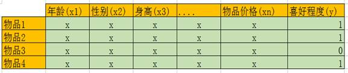
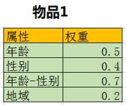
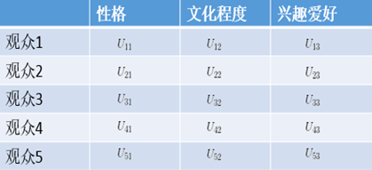
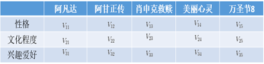
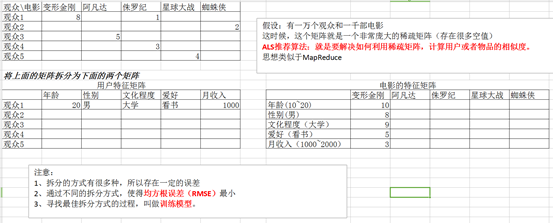

## 1. 推荐算法

### 1.1 基于流行度的算法

基于流行度的算法非常简单粗暴，类似于各大新闻、微博热榜等，根据PV、UV、日均PV或分享率等数据来按某种热度排序来推荐给用户。

这种算法的优点是简单，适用于刚注册的新用户。缺点也很明显，它无法针对用户提供个性化的推荐。基于这种算法也可做一些优化，比如加入用户分群的流行度排序，例如把热榜上的体育内容优先推荐给体育迷，把政要热文推给热爱谈论政治的用户。

### 1.2 协同过滤算法(CF)

**协同过滤算法（Collaborative Filtering：CF）**是很常用的一种算法，在很多电商网站上都有用到。CF算法包括基于用户的CF（**User-based CF**）和基于物品的CF（**Item-based CF**）。

#### 1.2.1 基于用户的协同过滤算法

- **基于用户（user）的CF原理如下：**
  - 分析各个用户对item的评价（通过浏览记录、购买记录等）；
  - 依据用户对item的评价计算得出所有用户之间的相似度；
  - 选出与当前用户最相似的N个用户；
  - 将这N个用户评价最高且当前用户又没有浏览过的item推荐给当前用户。

- **基于用户（user）的协同过滤举例：**
  - 首先我们根据网站的记录计算出一个用户与item的关联矩阵，如下：

​	

图中，行是不同的用户，列是所有物品，(x, y)的值则是x用户对y物品的评分（喜好程度）。我们可以把每一行视为一个用户对物品偏好的向量，然后计算每两个用户之间的向量距离，这里我们用余弦相似度来算：

然后得出用户向量之间相似度如下，其中值越接近1表示这两个用户越相似：

最后，我们要为用户1推荐物品，则找出与用户1相似度最高的N名用户（设N=2）评价的物品，去掉用户1评价过的物品，则是推荐结果。

#### 1.2.2 基于物品的协同过滤算法

基于物品的CF原理大同小异，只是主体在于物品。

- **基于物品（Item）的CF原理如下：**
  - 分析各个用户对item的浏览记录；
  - 依据浏览记录分析得出所有item之间的相似度；
  - 对于当前用户评价高的item，找出与之相似度最高的N个item；
  - 将这N个item推荐给用户。

### 1.3 基于内容的推荐算法(CB)

**CF算法**看起来很好很强大，通过改进也能克服各种缺点。那么问题来了，假如我是个《指环王》的忠实读者，我买过一本《双塔奇兵》，这时库里新进了第三部：《王者归来》，那么显然我会很感兴趣。然而基于之前的算法，无论是用户评分还是书名的检索都不太好使，于是**基于内容的推荐算法（Content-Based Recommendations：CB）**呼之欲出。

CB是最早被使用的推荐算法，它的思想非常简单：根据用户过去喜欢的物品（本文统称为 item），为用户推荐和他过去喜欢的物品相似的物品。而关键就在于这里的物品相似性的度量，这才是算法运用过程中的核心。 CB最早主要是应用在信息检索系统当中，所以很多信息检索及信息过滤里的方法都能用于CB中。

举个简单的例子：在京东上购物的小伙伴们应该都知道，每当你进入任何一个物品页面的时候都会有一个“猜你喜欢”的栏目，这时候他就会根据你经常购买的物品给你推荐相似的物品。例如对我来说：我经常购买互联网类书籍，所以它就会给我推荐类似的书籍（当然这里只是举个例子，京东的推荐算法肯定不可能那么单一，但是可以肯定的是他肯定会用到最基础的CB推荐算法）。

CB的过程一般包括以下三步：

(1) **物品表示（Item Representation）**：为每个item抽取出一些特征（也就是item的content了）来表示此item；

(2) **特征学习（Profile Learning）**：利用一个用户过去喜欢（及不喜欢）的item的特征数据，来学习出此用户的喜好特征（profile）；

(3) **生成推荐列表（Recommendation Generation）**：通过比较上一步得到的用户profile与候选item的特征，为此用户推荐一组相关性最大的item。

### 1.4 基于模型的算法

#### 1.4.1 逻辑回归预测算法（LR）

基于模型的方法有很多，用到的诸如机器学习的方法也能够很深，这里只简单介绍下比较简单的方法——**Logistics****回归预测**。我们通过分析系统中用户的行动和购买记录等数据，得到以下表：

 

表中的行是一种物品，x1...xn是影响用户行动的各种特点属性，如用户年龄段、性别、地域、物品的价格等等，y则是用户对该物品的喜好程度，可以是购买记录、阅读、收藏等等。通过大量这类的数据，我们可以回归计算出x1...xn对应的系数，**这即是各特点属性对应的权重**，**权重值越大则表明该属性对用户选择商品越重要**。

在计算的时候，单一的某种属性和另外一种属性可能其实不存在强关联。比如，年龄与购买护肤品这个行动其实不呈强关联，性别与购买护肤品也不强关联，但当我们把年龄与性别综合在一起斟酌时，它们便和购买行动产生了强关联。比如（我只是比如），20~30岁的女性用户更偏向于购买护肤品，这就叫交叉属性。通过反复测试和经验，我们可以调剂特点属性的组合，拟合出最准确的回归函数。**最后得出针对每种物品的属性权重**以下：

基于模型的算法由于快速、准确，适用于实时性比较高的业务如新闻、广告等，而若是需要这类算法到达更好的效果，则需要人工干预反复的进行属性的组合和挑选，也就是常说的Feature Engineering。而由于新闻的时效性，系统也需要反复更新线上的数学模型，以适应变化。

### 1.5 基于ALS的算法

**ALS** **是交替最小二乘** **（alternating least squares）** 的简称。

- **算法原理**

ALS算法是2008年以来，用的比较多的协同过滤算法。它已经集成到Spark的Mllib库中，使用起来比较方便。

从协同过滤的分类来说，ALS算法属于User-Item CF，也叫做混合CF。它同时考虑了User和Item两个方面。

用户和商品的关系，可以抽象为如下的三元组：<User,Item,Rating>。其中，Rating是用户对商品的评分，表征用户对该商品的喜好程度。

假设我们有一批用户数据，其中包含m个User和n个Item，则我们定义Rating矩阵，其中的元素表示第u个User对第i个Item的评分。

在实际使用中，由于n和m的数量都十分巨大，因此R矩阵的规模很容易就会突破1亿项。这时候，传统的矩阵分解方法对于这么大的数据量已经是很难处理了。

另一方面，一个用户也不可能给所有商品评分，因此，R矩阵注定是个稀疏矩阵。矩阵中所缺失的评分，又叫做missing item。

- **算法举例说明：**

 (1)     下面的矩阵R表示：观众对电影的喜好，即：打分的情况。**注意：实际情况下，这个矩阵可能非非常庞大，并且是一个稀疏矩阵**。

**矩阵 R**

(2)     这时，我们可以把这个大的稀疏矩阵R，拆分成两个小一点的矩阵：U和V。通过U和V来近似表示R，如下图

 

其中：

- U矩阵代表：用户的特征，包括三个维度：**性格，文化程度，兴趣爱好**

-  V矩阵代表：电影的特征，也包括三个维度：**性格，文化程度，兴趣爱好**

(3)     这样，U和V的乘积，近似表示R。

(4)     但是，**这样的表示是存在误差的**，因为对于一个U矩阵来说，我们并不可能说（性格，文化程度，兴趣爱好）这三个属性就代表着一个人对一部电影评价全部的属性，比如还有地域等因素。这个误差，我们用**RMSE****（均方根误差）**表示。

## 2. 分类算法

### 2.1 朴素贝叶斯算法(NB)

### 2.2 支持向量机算法(SVM)

### 2.3 K近邻算法(KNN)

### 2.4 决策树算法

## 3. 聚类算法

### 3.1 K-Means算法

### 3.2 DBScan算法

### 3.3 GMM/EM算法

### 3.4 Mean-Shift算法

### 3.5 凝聚层次算法

### 3.6 图团体检测算法

