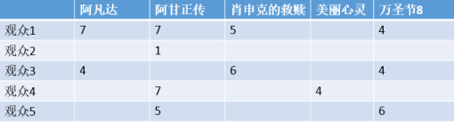
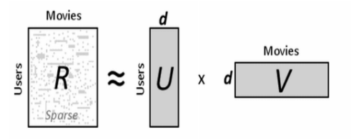

## 1. 推荐算法

### 1.1 基于流行度的算法

基于流行度的算法非常简单粗暴，类似于各大新闻、微博热榜等，根据PV、UV、日均PV或分享率等数据来按某种热度排序来推荐给用户。

这种算法的优点是简单，适用于刚注册的新用户。缺点也很明显，它无法针对用户提供个性化的推荐。基于这种算法也可做一些优化，比如加入用户分群的流行度排序，例如把热榜上的体育内容优先推荐给体育迷，把政要热文推给热爱谈论政治的用户。


### 1.2 协同过滤算法(CF)

**协同过滤算法（Collaborative Filtering：CF）**是很常用的一种算法，在很多电商网站上都有用到。CF算法包括基于用户的CF（**User-based CF**）和基于物品的CF（**Item-based CF**）。

#### 1.2.1 基于用户的协同过滤算法

- **基于用户（user）的CF原理如下：**
  - 分析各个用户对item的评价（通过浏览记录、购买记录等）；
  - 依据用户对item的评价计算得出所有用户之间的相似度；
  - 选出与当前用户最相似的N个用户；
  - 将这N个用户评价最高且当前用户又没有浏览过的item推荐给当前用户。


- **基于用户（user）的协同过滤举例：**
  - 首先我们根据网站的记录计算出一个用户与item的关联矩阵，如下：


​	

图中，行是不同的用户，列是所有物品，(x, y)的值则是x用户对y物品的评分（喜好程度）。我们可以把每一行视为一个用户对物品偏好的向量，然后计算每两个用户之间的向量距离，这里我们用余弦相似度来算：


然后得出用户向量之间相似度如下，其中值越接近1表示这两个用户越相似：


最后，我们要为用户1推荐物品，则找出与用户1相似度最高的N名用户（设N=2）评价的物品，去掉用户1评价过的物品，则是推荐结果。

#### 1.2.2 基于物品的协同过滤算法

基于物品的CF原理大同小异，只是主体在于物品。

- **基于物品（Item）的CF原理如下：**
  - 分析各个用户对item的浏览记录；
  - 依据浏览记录分析得出所有item之间的相似度；
  - 对于当前用户评价高的item，找出与之相似度最高的N个item；
  - 将这N个item推荐给用户。


### 1.3 基于内容的推荐算法(CB)

**CF算法**看起来很好很强大，通过改进也能克服各种缺点。那么问题来了，假如我是个《指环王》的忠实读者，我买过一本《双塔奇兵》，这时库里新进了第三部：《王者归来》，那么显然我会很感兴趣。然而基于之前的算法，无论是用户评分还是书名的检索都不太好使，于是**基于内容的推荐算法（Content-Based Recommendations：CB）**呼之欲出。

CB是最早被使用的推荐算法，它的思想非常简单：根据用户过去喜欢的物品（本文统称为 item），为用户推荐和他过去喜欢的物品相似的物品。而关键就在于这里的物品相似性的度量，这才是算法运用过程中的核心。 CB最早主要是应用在信息检索系统当中，所以很多信息检索及信息过滤里的方法都能用于CB中。

举个简单的例子：在京东上购物的小伙伴们应该都知道，每当你进入任何一个物品页面的时候都会有一个“猜你喜欢”的栏目，这时候他就会根据你经常购买的物品给你推荐相似的物品。例如对我来说：我经常购买互联网类书籍，所以它就会给我推荐类似的书籍（当然这里只是举个例子，京东的推荐算法肯定不可能那么单一，但是可以肯定的是他肯定会用到最基础的CB推荐算法）。

CB的过程一般包括以下三步：

(1) **物品表示（Item Representation）**：为每个item抽取出一些特征（也就是item的content了）来表示此item；

(2) **特征学习（Profile Learning）**：利用一个用户过去喜欢（及不喜欢）的item的特征数据，来学习出此用户的喜好特征（profile）；

(3) **生成推荐列表（Recommendation Generation）**：通过比较上一步得到的用户profile与候选item的特征，为此用户推荐一组相关性最大的item。


### 1.4 基于模型的算法

#### 1.4.1 逻辑回归预测算法（LR）

基于模型的方法有很多，用到的诸如机器学习的方法也能够很深，这里只简单介绍下比较简单的方法——**Logistics****回归预测**。我们通过分析系统中用户的行动和购买记录等数据，得到以下表：


 

表中的行是一种物品，x1...xn是影响用户行动的各种特点属性，如用户年龄段、性别、地域、物品的价格等等，y则是用户对该物品的喜好程度，可以是购买记录、阅读、收藏等等。通过大量这类的数据，我们可以回归计算出x1...xn对应的系数，**这即是各特点属性对应的权重**，**权重值越大则表明该属性对用户选择商品越重要**。

在计算的时候，单一的某种属性和另外一种属性可能其实不存在强关联。比如，年龄与购买护肤品这个行动其实不呈强关联，性别与购买护肤品也不强关联，但当我们把年龄与性别综合在一起斟酌时，它们便和购买行动产生了强关联。比如（我只是比如），20~30岁的女性用户更偏向于购买护肤品，这就叫交叉属性。通过反复测试和经验，我们可以调剂特点属性的组合，拟合出最准确的回归函数。**最后得出针对每种物品的属性权重**以下：


基于模型的算法由于快速、准确，适用于实时性比较高的业务如新闻、广告等，而若是需要这类算法到达更好的效果，则需要人工干预反复的进行属性的组合和挑选，也就是常说的Feature Engineering。而由于新闻的时效性，系统也需要反复更新线上的数学模型，以适应变化。


### 1.5 基于ALS的算法

**ALS** **是交替最小二乘** **（alternating least squares）** 的简称。

- **算法原理**

ALS算法是2008年以来，用的比较多的协同过滤算法。它已经集成到Spark的Mllib库中，使用起来比较方便。

从协同过滤的分类来说，ALS算法属于User-Item CF，也叫做混合CF。它同时考虑了User和Item两个方面。

用户和商品的关系，可以抽象为如下的三元组：<User,Item,Rating>。其中，Rating是用户对商品的评分，表征用户对该商品的喜好程度。

假设我们有一批用户数据，其中包含m个User和n个Item，则我们定义Rating矩阵，其中的元素表示第u个User对第i个Item的评分。

在实际使用中，由于n和m的数量都十分巨大，因此R矩阵的规模很容易就会突破1亿项。这时候，传统的矩阵分解方法对于这么大的数据量已经是很难处理了。

另一方面，一个用户也不可能给所有商品评分，因此，R矩阵注定是个稀疏矩阵。矩阵中所缺失的评分，又叫做missing item。

- **算法举例说明：**

 (1)     下面的矩阵R表示：观众对电影的喜好，即：打分的情况。**注意：实际情况下，这个矩阵可能非常庞大，并且是一个稀疏矩阵**。

**矩阵 R**



(2)     这时，我们可以把这个大的稀疏矩阵R，拆分成两个小一点的矩阵：U和V。通过U和V来近似表示R，如下图



其中：

- U矩阵代表：用户的特征，包括三个维度：**性格，文化程度，兴趣爱好**


-  V矩阵代表：电影的特征，也包括三个维度：**性格，文化程度，兴趣爱好**


(3)     这样，U和V的乘积，近似表示R。

(4)     但是，**这样的表示是存在误差的**，因为对于一个U矩阵来说，我们并不可能说（性格，文化程度，兴趣爱好）这三个属性就代表着一个人对一部电影评价全部的属性，比如还有地域等因素。这个误差，我们用**RMSE****（均方根误差）**表示。


## 2. 分类算法

### 2.1 朴素贝叶斯算法(NB)


### 2.2 支持向量机算法(SVM)

SVM(Support Vector Machine)中文名为支持向量机，是常见的一种判别方法。在机器学习领域，是一个有监督的学习模型，通常用来进行模式识别、分类以及回归分析。

#### 2.2.1 相关概念

**分类器：**分类器就是给定一个样本的数据，判定这个样本属于哪个类别的算法。例如在股票涨跌预测中，我们认为前一天的交易量和收盘价对于第二天的涨跌是有影响的，那么分类器就是通过样本的交易量和收盘价预测第二天的涨跌情况的算法。

**特征：**在分类问题中，输入到分类器中的数据叫做特征。以上面的股票涨跌预测问题为例，特征就是前一天的交易量和收盘价。

**线性分类器：**线性分类器是分类器中的一种，就是判定分类结果的根据是通过特征的线性组合得到的，不能通过特征的非线性运算结果作为判定根据。还以上面的股票涨跌预测问题为例，判断的依据只能是前一天的交易量和收盘价的线性组合，不能将交易量和收盘价进行开方，平方等运算。

#### 2.2.2 线性分类器起源

在实际应用中，我们往往遇到这样的问题：给定一些数据点，它们分别属于两个不同的类，现在要找到一个线性分类器把这些数据分成两类。

怎么分呢？把整个空间劈成两半呗（让我想到了盘古）。用二维空间举个例子，如上图所示，我们用一条直线把空间切割开来，直线左边的点属于类别-1（用三角表示），直线右边的点属于类别1（用方块表示）。

如果用数学语言呢，就是这样的：空间是由X1和X2组成的二维空间，直线的方程是X1+X2 = 1，用向量符号表示即为[1,1]^{T}[X1,X2]-1=0 。点x在直线左边的意思是指，当把x放入方程左边，计算结果小于0。同理，在右边就是把x放入方程左边，计算出的结果大于0。都是高中数学知识。

在二维空间中，用一条直线就把空间分割开了： 


在三维空间中呢，需要用一个平面把空间切成两半，对应的方程是X1+X2+X3=1，也就是
$$
[1,1,1]^{T}[X1,X2,X3]-1=0 
$$


在高维（n>3）空间呢？就需要用到n-1维的超平面将空间切割开了。那么抽象的归纳下：

如果用x表示数据点，用y表示类别（y取1或者-1，代表两个不同的类），一个线性分类器的学习目标便是要在n维的数据空间中找到一个超平面（hyper plane），把空间切割开，这个超平面的方程可以表示为(W^{T}中的T代表转置）： 
$$
W^{T}X+b=0
$$


#### 2.2.3  **感知器模型和逻辑回归**

常见的线性分类器有感知器模型和逻辑回归。上一节举出的例子是感知器模型，直接给你分好类。有时候，我们除了要知道分类器对于新数据的分类结果，还希望知道分类器对于这次分类的成功概率。逻辑回归就可以做这件事情。

逻辑回归（虽然称作回归，但是不是一个回归方法，却是一个分类算法。很蛋疼的说）将线性分类器的超平面方程计算结果通过logistic函数从正负无穷映射到0到1。这样，映射的结果就可以认为是分类器将x判定为类别1的概率，从而指导后面的学习过程。

举个例子，看天气预报，用感知器的天气预报只会告诉你明天要下雨（y=1），或者明天不下雨（y=-1）；而用了逻辑回归的天气预报就能告诉你明天有90%的概率要下雨，10%的概率不下雨。

逻辑回归的公式是
$$
g(z)=\frac{1}{1+e^{-z}}
$$
图像大概长这个样子：


怎么用呢？比如感知器模型中，将特征代入判别方程中，如果得到的值是-3，我们可以判定类别是-1（因为-3<0）。而逻辑回归中呢，将-3代入g(z)，我们就知道，该数据属于类别1的概率是0.05（近似数值，谢谢），那么属于类别-1的概率就是1 – 0.05 = 0.95。也就是用概率的观点描述这个事情。

#### 2.2.4 支持向量机 VS 感知器和逻辑回归

根据上面的讨论，我们知道了在多维空间下，用一个超平面就把数据分为了两类。这个超平面我们叫它为**分离超平面**。但是这个分离超平面可以有很多个，那么用哪个呢？


上图中，对于目前的训练数据，绿色和黑色的直线（二维特征空间，分离超平面就是直线啦）都可以很可以很好的进行分类。但是，通过已知数据建立分离超平面的目的，是为了对于未知数据进行分类的。在下图中，蓝色的星星图案就是新加入的真实数据。 


这时候我们就可以看出不同的分离超平面的选择对于分类效果的影响了。有的绿线会将三个点都划归蓝色圆圈，有的绿线会将三个点都划归红色正方形。

那么绿线和黑线留下谁？我们认为，已有的训练数据中，每个元素距离分离超平面都有一个距离。在添加超平面的时候，尽可能的使最靠近分离超平面的那个元素与超平面的距离变大。这样，加入新的数据的时候，分的准的概率会最大化。感知器模型和逻辑回归都不能很好的完成这个工作，该我们的支持向量机（support vector machine，SVM）出场了。

首先，SVM将函数间隔（
$$
\left| W^{T}X+b \right| 
$$
，将特征值代入分离超平面的方程中，得到的绝对值）归一化，归一化的目的是除掉取值尺度的影响；其次，对所有元素求到超平面的距离，（这个距离是
$$
\frac{\left| W^{T}X+b \right| }{\left| W \right| }
$$
，也就是几何间隔）。给定一个超平面P，所有样本距离超平面P的距离可以记为
$$
d_{ij}=\frac{\left| W^{T}X+b \right| }{\left| W \right| } 
$$
，这其中最小的距离记为D_{P}，SVM的作用就是找到D_{P}最大的超平面。

可以看出，大部分数据对于分离超平面都没有作用，能决定分离超平面的，只是已知的训练数据中很小的一部分。这与逻辑回归有非常大的区别。上图中，决定黑色的这条最优分离超平面的数据只有下方的两个红色的数据点和上方的一个蓝色的数据点。这些对于分离超平面有着非常强大影响的数据点也被称为支持向量（看没看到，这就是传说中的支持向量啦，原来如此）。

#### 2.2.5 引入黑科技-核函数

上面说的都是在原始特征的维度上，能直接找到一条分离超平面将数据完美的分成两类的情况。但如果找不到呢？

比如，原始的输入向量是一维的，0< x <1的类别是1，其他情况记做-1。这样的情况是不可能在1维空间中找到分离超平面的（一维空间中的分离超平面是一个点，aX+b=0）。你用一个点切一下试试？ 


这就要说到SVM的黑科技—核函数技巧。核函数可以将原始特征映射到另一个高维特征空间中，解决原始空间的线性不可分问题。

继续刚才那个数轴。 


如果我们将原始的一维特征空间映射到二维特征空间X^{2}和x，那么就可以找到分离超平面
$$
X^{2}-X=0
$$
。当X^{2}-X<0的时候，就可以判别为类别1，当X^{2}-X>0 的时候，就可以判别为类别0。如下图： 


再将X^2-X=0映射回原始的特征空间，就可以知道在0和1之间的实例类别是1，剩下空间上（小于0和大于1）的实例类别都是0啦。 


利用特征映射，就可以将低维空间中的线性不可分问题解决了。是不是很神奇，这就是特征映射的牛逼之处了。核函数除了能够完成特征映射，而且还能把特征映射之后的内积结果直接返回，大幅度降低了简化了工作，这就是为啥采用核函数的原因。

#### 2.2.6 SVM三种模型

SVM有三种模型，由简至繁为

当训练数据训练可分时，通过硬间隔最大化，可学习到硬间隔支持向量机，又叫**线性可分支持向量机**
当训练数据训练近似可分时，通过软间隔最大化，可学习到软间隔支持向量机，又叫**线性支持向量机**

当训练数据训练不可分时，通过软间隔最大化及核技巧(kernel trick)，可学习到**非线性支持向量机**

#### 2.2.7 代码

代码已在[github](https://github.com/fuqiuai/lihang_algorithms/blob/master/svm/svm_sklearn.py)上实现，这里也贴出来

```python
# encoding=utf-8

import time

import numpy as np
import pandas as pd
from sklearn.cross_validation import train_test_split
from sklearn.metrics import accuracy_score
from sklearn import datasets
from sklearn import svm

if __name__ == '__main__':

    print('prepare datasets...')
    # Iris数据集
    # iris=datasets.load_iris()
    # features=iris.data
    # labels=iris.target

    # MINST数据集
    raw_data = pd.read_csv('../data/train_binary.csv', header=0)  # 读取csv数据，并将第一行视为表头，返回DataFrame类型
    data = raw_data.values
    features = data[::, 1::]
    labels = data[::, 0]    # 选取33%数据作为测试集，剩余为训练集

    train_features, test_features, train_labels, test_labels = train_test_split(features, labels, test_size=0.33, random_state=0)

    time_2=time.time()
    print('Start training...')
    clf = svm.SVC()  # svm class   
    clf.fit(train_features, train_labels)  # training the svc model 
    time_3 = time.time()
    print('training cost %f seconds' % (time_3 - time_2))

    print('Start predicting...')
    test_predict=clf.predict(test_features)
    time_4 = time.time()
    print('predicting cost %f seconds' % (time_4 - time_3))

    score = accuracy_score(test_labels, test_predict)
print("The accruacy score is %f" % score)
```

测试数据集为经过二分类处理后的MNIST数据集，获取地址[train_binary.csv](https://github.com/fuqiuai/lihang_algorithms/blob/master/data/train_binary.csv)

#### 2.2.8 运行结果


### 2.3 K近邻算法(KNN)

又叫**K-邻近算法**，是监督学习中的一种分类算法。目的是根据已知类别的样本点集求出待分类的数据点类别。

#### 2.3.1 基本思想

kNN的思想很简单：在训练集中选取离输入的数据点最近的k个邻居，根据这个k个邻居中出现次数最多的类别（最大表决规则），作为该数据点的类别。kNN算法中，所选择的邻居都是已经正确分类的对象。

e.g：下图中，绿色圆要被决定赋予哪个类，是红色三角形还是蓝色四方形？如果k=3，由于红色三角形所占比例为2/3，绿色圆将被赋予红色三角形那个类，如果k=5，由于蓝色四方形比例为3/5，因此绿色圆被赋予蓝色四方形类。


#### 2.3.2 算法复杂度

kNN是一种lazy-learning算法，分类器不需要使用训练集进行训练，因此训练时间复杂度为0；kNN分类的计算复杂度和训练集中的文档数目成正比，也就是说，如果训练集中文档总数为n，那么kNN的分类时间复杂度为O(n)；因此，最终的时间复杂度是O(n)。

#### 2.3.3 优点

1. 理论成熟，思想简单，既可以用来做分类也可以用来做回归 ；
2. 适合对稀有事件进行分类（例如：客户流失预测）；
3. 特别适合于多分类问题(multi-modal,对象具有多个类别标签，例如：根据基因特征来判断其功能分类)， kNN比SVM的表现要好。

#### 2.3.4 缺点

1. 当样本不平衡时，如一个类的样本容量很大，而其他类样本容量很小时，有可能导致当输入一个新样本时，该样本的K个邻居中大容量类的样本占多数；
2. 计算量较大，因为对每一个待分类的文本都要计算它到全体已知样本的距离，才能求得它的K个最近邻点；
3. 可理解性差，无法给出像决策树那样的规则。

#### 2.3.5 代码

代码已在[github](https://github.com/fuqiuai/datamining_algorithms/blob/master/kNN/kNN.py)上实现，这里也贴出来。

```python
# coding:utf-8

import numpy as np

def createDataset():
    '''
    创建训练集,特征值分别为搞笑镜头、拥抱镜头、打斗镜头的数量
    '''
    learning_dataset = {"宝贝当家": [45, 2, 9, "喜剧片"],
              "美人鱼": [21, 17, 5, "喜剧片"],
              "澳门风云3": [54, 9, 11, "喜剧片"],
              "功夫熊猫3": [39, 0, 31, "喜剧片"],
              "谍影重重": [5, 2, 57, "动作片"],
              "叶问3": [3, 2, 65, "动作片"],
              "伦敦陷落": [2, 3, 55, "动作片"],
              "我的特工爷爷": [6, 4, 21, "动作片"],
              "奔爱": [7, 46, 4, "爱情片"],
              "夜孔雀": [9, 39, 8, "爱情片"],
              "代理情人": [9, 38, 2, "爱情片"],
              "新步步惊心": [8, 34, 17, "爱情片"]}
    return learning_dataset


def kNN(learning_dataset,dataPoint,k):
    '''
    kNN算法,返回k个邻居的类别和得到的测试数据的类别
    '''
    # s1:计算一个新样本与数据集中所有数据的距离
    disList=[]
    for key,v in learning_dataset.items():
       d=np.linalg.norm(np.array(v[:3])-np.array(dataPoint))
       disList.append([key,round(d,2)])

    # s2:按照距离大小进行递增排序
    disList.sort(key=lambda dis: dis[1]) 

    # s3:选取距离最小的k个样本
    disList=disList[:k]

    # s4:确定前k个样本所在类别出现的频率，并输出出现频率最高的类别
    labels = {"喜剧片":0,"动作片":0,"爱情片":0}  
    for s in disList:  
        label = learning_dataset[s[0]]  
        labels[label[len(label)-1]] += 1  
    labels =sorted(labels.items(),key=lambda asd: asd[1],reverse=True)

    return labels,labels[0][0]


if __name__ == '__main__':

    learning_dataset=createDataset()

    testData={"唐人街探案": [23, 3, 17, "？片"]}
    dataPoint=list(testData.values())[0][:3]

    k=6

    labels,result=kNN(learning_dataset,dataPoint,k)
    print(labels,result,sep='\n')
```


### 2.4 决策树算法


## 3. 聚类算法

### 3.1 K均值算法(K-Means)

又叫**K-均值算法**，是非监督学习中的聚类算法。

#### 3.1.1 基本思想

k-means算法比较简单。在k-means算法中，用cluster来表示簇；容易证明k-means算法收敛等同于所有质心不再发生变化。基本的k-means算法流程如下：

```
选取k个初始质心（作为初始cluster，每个初始cluster只包含一个点）；  
repeat：  
    对每个样本点，计算得到距其最近的质心，将其类别标为该质心所对应的cluster；  
    重新计算k个cluster对应的质心（质心是cluster中样本点的均值）；  
until 质心不再发生变化 
```

repeat的次数决定了算法的迭代次数。实际上，k-means的本质是最小化目标函数，目标函数为每个点到其簇质心的距离的平方和：


N是元素个数，x表示元素，c(j)表示第j簇的质心

#### 3.1.2 算法复杂度

时间复杂度是O(nkt) ,其中n代表元素个数，t代表算法迭代的次数，k代表簇的数目

#### 3.1.3 优点

1. 简单、快速；
2. 对大数据集有较高的效率并且是可伸缩性的；
3. 时间复杂度近于线性，适合挖掘大规模数据集。

#### 3.1.4 缺点

1. k-means是局部最优，因而对初始质心的选取敏感；
2. 选择能达到目标函数最优的k值是非常困难的。

#### 3.1.5 代码

代码已在[github](https://github.com/fuqiuai/datamining_algorithms/blob/master/K-means/Kmeans.py)上实现，**这里也贴出来**

```python
# coding:utf-8

import numpy as np
import matplotlib.pyplot as plt


def loadDataSet(fileName):
    '''
    加载测试数据集，返回一个列表，列表的元素是一个坐标
    '''
    dataList = []
    with open(fileName) as fr:
        for line in fr.readlines():
            curLine = line.strip().split('\t')
            fltLine = list(map(float,curLine))
            dataList.append(fltLine)
    return dataList


def randCent(dataSet, k):
    '''
    随机生成k个初始的质心
    '''
    n = np.shape(dataSet)[1] # n表示数据集的维度
    centroids = np.mat(np.zeros((k,n)))
    for j in range(n):
        minJ = min(dataSet[:,j])
        rangeJ = float(max(dataSet[:,j]) - minJ)
        centroids[:,j] = np.mat(minJ + rangeJ * np.random.rand(k,1))
    return centroids


def kMeans(dataSet, k):
    '''
    KMeans算法，返回最终的质心坐标和每个点所在的簇
    '''
    m = np.shape(dataSet)[0] # m表示数据集的长度（个数）
    clusterAssment = np.mat(np.zeros((m,2)))

    centroids = randCent(dataSet, k) # 保存k个初始质心的坐标
    clusterChanged = True
    iterIndex=1 # 迭代次数
    while clusterChanged:
        clusterChanged = False
        for i in range(m):
            minDist = np.inf; minIndex = -1
            for j in range(k):
                distJI = np.linalg.norm(np.array(centroids[j,:])-np.array(dataSet[i,:]))
                if distJI < minDist:
                    minDist = distJI; minIndex = j
            if clusterAssment[i,0] != minIndex: clusterChanged = True
            clusterAssment[i,:] = minIndex,minDist**2
            print("第%d次迭代后%d个质心的坐标:\n%s"%(iterIndex,k,centroids)) # 第一次迭代的质心坐标就是初始的质心坐标
            iterIndex+=1
        for cent in range(k):
            ptsInClust = dataSet[np.nonzero(clusterAssment[:,0].A==cent)[0]]#get all the point in this cluster
            centroids[cent,:] = np.mean(ptsInClust, axis=0)
    return centroids, clusterAssment


def showCluster(dataSet, k, centroids, clusterAssment):
    '''
    数据可视化,只能画二维的图（若是三维的坐标图则直接返回1）
    '''
    numSamples, dim = dataSet.shape
    if dim != 2:
        return 1

    mark = ['or', 'ob', 'og', 'ok','oy','om','oc', '^r', '+r', 'sr', 'dr', '<r', 'pr']

    # draw all samples
    for i in range(numSamples):
        markIndex = int(clusterAssment[i, 0])
        plt.plot(dataSet[i, 0], dataSet[i, 1], mark[markIndex])

    mark = ['Pr', 'Pb', 'Pg', 'Pk','Py','Pm','Pc','^b', '+b', 'sb', 'db', '<b', 'pb']
    # draw the centroids
    for i in range(k):
        plt.plot(centroids[i, 0], centroids[i, 1], mark[i], markersize = 12)

    plt.show()


if __name__ == '__main__':

    dataMat = np.mat(loadDataSet('./testSet')) #mat是numpy中的函数，将列表转化成矩阵

    k = 4 # 选定k值，也就是簇的个数（可以指定为其他数）
    cent, clust = kMeans(dataMat, k)

    showCluster(dataMat, k, cent, clust)
```


测试数据集获取地址为[testSet](https://github.com/fuqiuai/datamining_algorithms/blob/master/K-means/testSet)


### 3.2 DBScan算法


### 3.3 GMM/EM算法


### 3.4 Mean-Shift算法


### 3.5 凝聚层次算法


### 3.6 图团体检测算法

